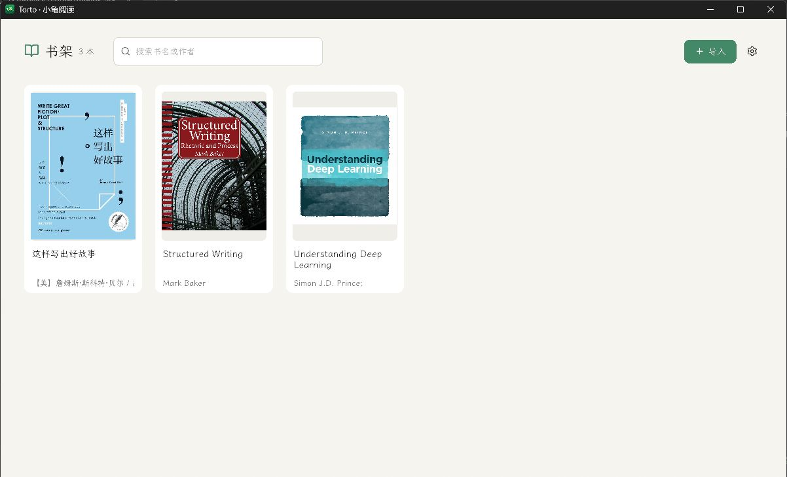
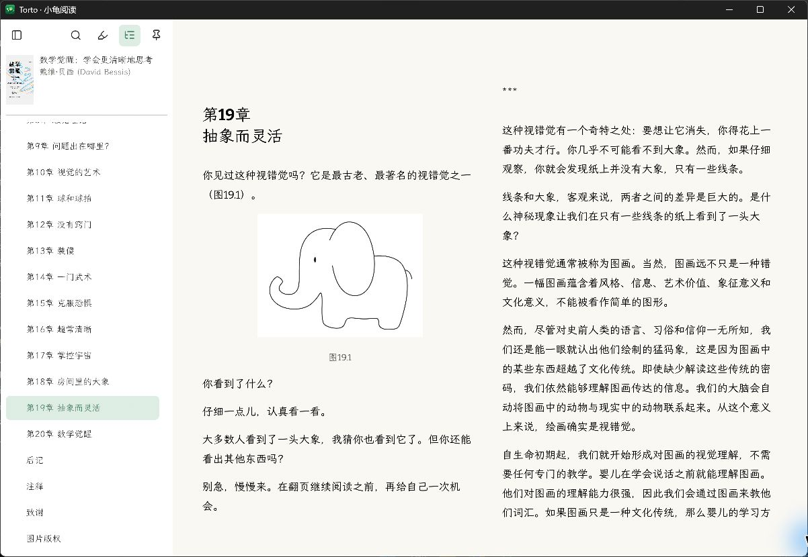

<p align="center">
  <strong>English</strong> · <a href="README.zh-CN.md">简体中文</a>
</p>

<p align="center">
  
</p>

<h1 id="torto" align="center">Torto</h1>

<p align="center">
  A focused, lightweight ebook reader for Windows and macOS.<br>
  Native Rust rendering, local-first by default, and no WebView.
</p>

<p align="center">
  <a href="https://github.com/L-Chris/torto/releases/latest"></a>
  <a href="LICENSE"></a>
  
  
</p>

## About

Torto is an open-source desktop reader for people who want their books to stay on their own computer. It combines a native bookshelf with single- and two-page reading, full-text search, highlights, translation, an optional AI reading assistant, and direct WebDAV sync.

Unlike browser-based readers, Torto parses, lays out, paginates, and renders book content with a native Rust pipeline built on egui, Parley, Vello, and wgpu.

## Highlights

- **Local-first library** — Import books in bulk, browse covers, search by title or author, and continue where you left off.
- **Comfortable native reading** — Single- or two-page layouts, adjustable fonts and weight, themes, table-of-contents navigation, and keyboard or mouse paging.
- **Reading tools** — Text selection, highlights, full-book search, translation, and an optional AI assistant with citations back to the book.
- **Private sync** — Sync books and reading state directly to your own WebDAV provider. Credentials are stored in the operating system's secure credential store.
- **Broad format support** — DRM-free EPUB, MOBI, AZW, AZW3/KF8, FB2, FBZ, CBZ, and PDF.

## Screenshots

### Local bookshelf



### Two-page reading



## Download

Download the latest build from [GitHub Releases](https://github.com/L-Chris/torto/releases/latest).

| Platform | Package | Requirements |
| --- | --- | --- |
| Windows | `Torto-*-x86_64.msi` | 64-bit Windows 10 or 11 |
| macOS, Apple silicon | `Torto-*-macos-arm64.dmg` | macOS 12 or later |
| macOS, Intel | `Torto-*-macos-x86_64.dmg` | macOS 12 or later |

## Privacy

Imported books and reading data remain in Torto's local application-data directory. AI and translation features are opt-in and only send content when you configure and actively use a provider. WebDAV connections go directly from Torto to the service you choose; there is no Torto-operated relay.

## Development

Torto uses Rust `1.97.1`. The internal workspace package remains named `rebook-desktop`, while the shipped application is `Torto` (`torto.exe` on Windows).

```powershell
cargo run --locked -p rebook-desktop
cargo fmt --all --check
cargo clippy --workspace --all-targets -- -D warnings
cargo test --workspace
```

The core reading path is `parser → Reading IR → layout → renderer`. See the [native rendering architecture decision](docs/adr-0001-native-epub-renderer.md), [WebDAV sync protocol](docs/webdav-sync-v1.md), and [known upstream issues](docs/known-upstream-issues.md) for details.

## Project status

Torto is under active development. DRM-protected books are not supported. The native renderer intentionally does not aim for full browser-level HTML/CSS compatibility, so complex fixed layouts, vertical writing, Ruby annotations, and some interactive book content may not render completely yet.

Please report reproducible problems in [Issues](https://github.com/L-Chris/torto/issues). Include the book format, screenshots, and reproduction steps, but do not upload complete copyrighted books.

## License

Torto is available under the [MIT License](LICENSE).
