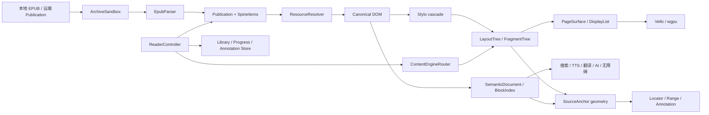

# rebook / rebook-web 架构复盘与 Rust 迁移方案

> 历史调研：其中的领域边界仍可参考，但 DOM/Stylo/Taffy/Blitz 主链已被破坏性替换。现行架构见 [ADR-0001](adr-0001-native-epub-renderer.md) 和 [当前状态](phase-0-status.md)。

- 调研日期：2026-07-23
- 调研对象：本地 `rebook` 与 `rebook-web` 当前工作树
- 基线提交：`rebook@0176bae`、`rebook-web@b17d768`
- 注意：两个仓库都有未提交改动，本文描述的是当前工作树行为，不只是上述提交

## 结论

可以参考，而且 `rebook` 已经验证了不少阅读器领域模型；但应该复用它的边界、状态机和测试语义，不能把浏览器 DOM 渲染路径直接翻译成 Rust。

最值得保留的主干是：

```text
Parser/Loader
    -> Book/Section（格式无关、章节懒加载）
    -> ReaderSession（生命周期与命令）
    -> ContentEngineRouter（可重排/固定版式路由）
    -> PageSurface + TextProvider（显示与交互边界）
    -> Locator/Range（进度、选择、搜索、批注的统一坐标）
```

Rust 版需要在这条主干中增加一条浏览器版没有完整保留的规范渲染管线：

```text
XHTML DOM -> Stylo 级联 -> Layout/FragmentTree -> DisplayList -> Vello/wgpu
      \-> SemanticDocument/BlockIndex -> 搜索/TTS/翻译/AI/无障碍
```

`SemanticDocument` 是从规范 DOM 派生出来的服务索引，不是正文排版的真相源。两条管线通过稳定的 `SourceAnchor` / `Locator` 对齐。

## 现有项目的实际架构

### rebook 核心

| 层 | 当前实现 | Rust 版判断 |
| --- | --- | --- |
| 输入与解析 | `ParserRegistry` 按优先级检测格式；文件或 `ArchiveParserInput` 都能打开 | 保留这个入口模型 |
| 归档读取 | `Loader` 暴露 entries、`loadText`、`loadBlob`、size | 保留懒加载思想，改成受预算约束的 byte/resource handle |
| 阅读模型 | `Book` + 有序 `Section[]`；章节可 `load/unload`，可按 href/CFI 定位 | 保留，改名为 `Publication` + `SpineItem` 更贴近规范 |
| 章节缓存 | `createCachedReflowableAccessors` 分别缓存 document、segments、blocks 的 Promise | 保留分层缓存和并发请求合并；增加容量、取消和代际失效 |
| 会话 | `ReaderSession` 负责 open/close、插件、导航、搜索、事件桥接 | 基本照搬职责，做成串行命令状态机 |
| 引擎路由 | `ContentEngineRouter` 在 fixed/reflowable 引擎间选择并回放样式、布局、marks | 保留；MVP 只启用 reflowable，但接口从第一天存在 |
| 渲染协议 | `Renderer` 暴露 open、goTo、next/prev、styles、marks、selection、surface | 保留语义，Rust 中拆成命令、事件与只读快照 |
| 可读内容 | `ReadableContentUnit` 统一章节/页；blocks 优先，逐级降级到 segments/document/text | 保留作为服务层，不用于完整 CSS 排版 |
| 位置与范围 | `BookLocation`、`BookRange`、`BookSelection` 覆盖 reflowable/fixed/image/text | 保留 union/enum 设计，增强版本和文本引用回退 |
| 虚拟窗口 | `BlockWindowEvent` 通知当前页附近 block 范围，插件声明预取页数 | 保留并泛化为 `ViewportWindow` 服务总线 |
| 浏览器正文 | 只重建当前可见语义块 DOM，通过 line window/page model 分页或滚动 | 只参考虚拟化和几何不变量，不能作为原生 CSS renderer 设计 |

关键代码入口：

- [`Book` / `Section` / relocate / block-window](../../rebook/src/core/types.ts)
- [`Loader`](../../rebook/src/core/loader.ts)
- [`ParserRegistry`](../../rebook/src/core/parser.ts)
- [章节派生数据缓存](../../rebook/src/core/section-cache.ts)
- [`ReaderSession`](../../rebook/src/core/reader.ts)
- [`Renderer`](../../rebook/src/core/renderer.ts)
- [`ContentEngineRouter`](../../rebook/src/core/content-engine-router.ts)
- [位置、范围和选择](../../rebook/src/core/location.ts)
- [格式无关的可读内容](../../rebook/src/core/readable-content.ts)
- [搜索](../../rebook/src/search.ts)
- [可重排页面几何](../../rebook/src/core/reflowable-page-model.ts)
- [语义块预排版](../../rebook/src/core/pretext.ts)

### rebook 的 EPUB 路径

[`src/parsers/epub.ts`](../../rebook/src/parsers/epub.ts) 中值得迁移的是处理顺序和兼容策略：

1. 读取 `META-INF/container.xml`；
2. 读取 OPF，构建 metadata、manifest、spine；
3. 建立资源加载器；
4. 为 spine 创建懒加载 Section；
5. 解析 EPUB 3 nav，必要时回退 EPUB 2 NCX；
6. 建立 href、fragment、CFI 与章节索引映射；
7. 按需解析 XHTML、CSS、图片尺寸和派生语义块。

可参考的工程细节：

- 同一个资源的并发请求合并为一个 pending task；
- document、CSS、blob、图片尺寸分别缓存，不混成一个大缓存；
- CSS `@import` 有循环检测；
- 无效 XHTML 可在兼容模式下回退到 HTML parser；
- 真实 EPUB 中路径大小写、percent encoding 和错误相对路径需要诊断与受控恢复；
- manifest 查找失败时的后缀匹配只能作为有告警的兼容模式，不能静默成为安全边界；
- 每个 Section 都有显式 `load/unload`，Book 有显式 `destroy`。

不应迁移的浏览器实现：

- 将资源改写为 Blob URL；
- 依赖 `DOMAdapter`、`URLFactory` 或浏览器 `document`；
- 把外链 CSS 规则压平为浏览器 DOM 上的临时样式；
- 把 `TextBlock` 重建成一个近似 HTML DOM 后交给浏览器排版。

Rust 版应保留原始规范 DOM 与样式来源，资源始终通过进程内 `PublicationUrl` 和 `ResourceResolver` 获取。

### rebook-web 应用层

`rebook-web` 验证了本地优先阅读器需要的完整闭环：导入、元数据/封面提取、打开、进度节流保存、搜索跳转、高亮/批注、远程资源懒加载和同步。

值得迁移的行为：

- [`local-library.ts`](../../rebook-web/src/lib/local-library.ts)：书籍文件、封面、内容 hash、进度、locator、同步身份分开建模；
- [`remote-publication.ts`](../../rebook-web/src/lib/remote-publication.ts)：远端 manifest 与按资源读取共用同一个 Loader 协议，并合并并发请求；
- [`annotations.ts`](../../rebook-web/src/lib/annotations.ts)：批注使用客户端 UUID、version、dirty、tombstone、cursor 增量同步，冲突时保留本地副本；
- [`ReaderWorkspace.tsx`](../../rebook-web/src/features/reader/ReaderWorkspace.tsx)：读取 `relocate` 保存进度；selection 生成批注；mark activation 打开批注；搜索结果通过 block + offset 高亮。

必须改进的地方：

- `ReaderWorkspace.tsx` 同时管理 UI、读者设置、引擎重建、远端加载、插件、搜索、TTS、AI 和批注，文件已超过七千行；桌面版必须拆成 controller/store/service，不能复制这个单体协调器；
- 当前书架 locator 只保存 `unitIndex + fraction + totalFraction + tocLabel`，重排和书籍修订后的恢复不够稳；Rust 版必须保存 href、结构锚点和 text quote；
- IndexedDB 把整本文件 Blob 放入记录对桌面端不合适；桌面端使用托管文件目录，数据库只保存路径、hash 和元数据；
- 浏览器事件和大量 React effect 隐含了顺序关系；Rust 版用显式命令队列、取消令牌和 generation id 消除竞态；
- 动态 JavaScript 插件不能进入原生正文内核；先用 Rust typed service traits，第三方扩展另设进程隔离方案。

## 复用决策矩阵

| 现有设计 | 决策 | Rust 版落点 |
| --- | --- | --- |
| Parser Registry | 直接借鉴 | `FormatSniffer` + `PublicationFactory` |
| Loader/remote loader | 直接借鉴语义 | `ResourceResolver` + `ResourceHandle` |
| Book/Section | 直接借鉴并改名 | `Publication` + `SpineItem` |
| Section 三类派生数据缓存 | 借鉴 | `DocumentCache` + `SemanticCache` + `LayoutCache` |
| EPUB 初始化阶段 | 迁移并加强验证 | `rebook-formats::epub` open pipeline |
| ResourceLoader pending/cache/ref-count | 迁移思想 | 有预算、可取消的 `ResourceStore` |
| ReadableContent/blocks | 保留为派生索引 | 搜索、TTS、翻译、AI、无障碍 |
| ReaderSession | 直接借鉴职责 | `ReaderController` actor/state machine |
| ContentEngineRouter | 直接借鉴 | `ReflowableEngine` / `FixedLayoutEngine` |
| Renderer state replay | 直接借鉴 | `ReaderPreferences` 快照重放 |
| PageSurface/TextProvider | 直接借鉴 | 页面 scene、命中测试、范围映射的边界 |
| BlockWindow consumers | 泛化后借鉴 | 视口预取与后台服务调度 |
| BookLocation/Range/Selection | 直接借鉴并增强 | `LocatorV1` / `TextRange` / `Selection` |
| pretext/page model | 参考算法与测试 | 快速原型、几何不变量、分页窗口 |
| Browser DOM renderer | 不迁移 | 原生 FragmentTree + DisplayList |
| Blob URL rewrite | 不迁移 | `epub://` 逻辑 URL + resolver |
| IndexedDB/localStorage | 不迁移实现 | 托管文件 + redb；全文索引可加 Tantivy |
| ReaderWorkspace 单体组件 | 不迁移 | AppStore + ReaderController + 独立 services |
| JS 插件直接包裹 Book | 不进入 MVP | typed Rust services；未来进程外扩展 |

## Rust 目标架构

### 总体数据流



层级依赖必须单向：

```text
desktop -> reader -> renderer -> publication <- epub
             |                         |
             +-------> storage <-------+
```

`renderer` 不认识 EPUB ZIP；`epub` 不认识 GPU 或窗口；`storage` 不持有渲染器对象；桌面 UI 只发送命令并订阅状态。

### Cargo workspace

```text
rebook-desktop/
  apps/
    desktop/          # winit/wgpu/egui、平台集成、AppStore
  crates/
    publication/      # Metadata、Link、PublicationUrl、Locator、Range、事件
    epub/             # OCF/OPF/Nav/NCX、归档安全、字体混淆
    renderer/         # DOM/Stylo、layout、fragment、paint、hit-test
    reader/           # ReaderController、引擎路由、命令、预取、服务协议
    storage/          # 书库、设置、进度、批注、迁移
  test-data/
  docs/
```

逻辑上还存在 archive、semantic、search 等模块，但 MVP 先放进上述五个 crate，避免过早拆包。等到 API 稳定或编译时间成为问题再独立。

### Publication 与资源协议

```rust
pub trait Publication: Send + Sync {
    fn id(&self) -> &PublicationId;
    fn metadata(&self) -> &Metadata;
    fn reading_order(&self) -> &[SpineItem];
    fn table_of_contents(&self) -> &[TocEntry];
    fn resolve_href(&self, base: &PublicationUrl, href: &str) -> Result<ResolvedLink>;
    fn resource(&self, href: &PublicationUrl) -> Result<ResourceHandle>;
}

pub struct SpineItem {
    pub id: SpineItemId,
    pub href: PublicationUrl,
    pub media_type: MediaType,
    pub linear: bool,
    pub properties: SpineProperties,
}
```

`ResourceHandle` 负责在读取时执行单文件大小、总解压量、压缩比、媒体类型和取消检查。这样本地 ZIP、测试内存资源和未来远端资源可以共用协议，同时不会让网络异步语义泄漏到 Publication 模型。

打开过程分成可观测阶段：

```text
Sniff -> Container -> Package -> Manifest/Spine -> Navigation
      -> PublicationReady -> FirstDocument -> FirstLayout -> FirstPaint
```

每一阶段都返回结构化诊断、耗时和取消结果。包文档已可用时就发布 `PublicationReady`，不等待全文解析。

### 三种内容表示

1. `CanonicalDocument`：规范 XHTML/XML DOM、namespace、属性、作者 CSS 链接；它是级联和排版真相源。
2. `SemanticDocument`：标题、段落、列表、图片说明、表格文本等稳定 block/segment；它是搜索、TTS、翻译、AI 和无障碍输入。
3. `FragmentTree/PageSurface`：某次 viewport、DPI、字体和用户样式下的几何结果；它是短生命周期派生物。

三层都引用同一种源锚点：

```rust
pub struct SourceAnchor {
    pub spine: SpineItemId,
    pub node: StableNodeId,
    pub text_offset: TextOffset,
}
```

`StableNodeId` 来自解析时的确定性 DOM 路径/ID 映射，不使用内存地址；`TextOffset` 内部固定一种单位，并在 API 边界明确 UTF-8 byte、Unicode scalar 与 grapheme 的转换。

### ReaderController 与内容引擎

UI 只能发命令：

```text
Open / Close / GoTo / Next / Previous
SetViewport / SetPreferences / Search
BeginSelection / UpdateSelection / CommitAnnotation
```

核心状态机：

```text
Idle -> Opening -> Ready -> LayingOut -> Displaying
          |          |          |
          +-------- Error <-----+
```

所有会改变当前书、排版参数或视口的命令串行化。每次 open 和 reflow 增加 `generation_id`；后台解析、图片解码和布局结果只有 generation 匹配时才能提交，旧任务收到取消信号后退出。

`ContentEngineRouter` 初始包含：

- `ReflowableEngine`：MVP 主线，连续滚动；Phase 2 增加 page fragmentation；
- `FixedLayoutEngine`：接口占位，Phase 3 实现；
- `FallbackEngine`：给不支持的 media type 生成明确错误页，而不是崩溃。

切换引擎或重建 renderer 时重放同一个 `ReaderPreferences`、marks 和 locator 快照，这一点直接沿用 rebook 的 state replay 思路。

### Surface、窗口与后台服务

`PageSurface` 是 UI 与引擎之间的只读快照：

```rust
pub struct PageSurface {
    pub id: SurfaceId,
    pub scene: SceneId,
    pub viewport: Rect,
    pub visible_range: TextRange,
    pub locator: LocatorV1,
    pub hit_test: Arc<HitTestIndex>,
    pub accessibility: Arc<AccessibilitySubtree>,
}
```

引擎只保留当前视口及前后窗口：

- 当前 surface 必须常驻；
- 前后 1–2 页/一个章节片段预布局；
- 图片按解码像素成本计入缓存，不只按压缩 bytes；
- document、style、layout、scene、image 分别设置预算；
- resize 时优先保证当前锚点的粗略 surface，再后台提交精确重排；
- `ViewportWindowChanged` 通知搜索预热、TTS、翻译等消费者，各消费者只声明需要的窗口和优先级。

### Locator、进度与批注

不要沿用 rebook-web 只靠 `totalFraction` 恢复的做法。持久化格式从第一版版本化：

```rust
pub struct LocatorV1 {
    pub publication_id: PublicationId,
    pub href: PublicationUrl,
    pub progression: Option<f64>,
    pub total_progression: Option<f64>,
    pub position: Option<u64>,
    pub source: Option<SourceRange>,
    pub partial_cfi: Option<String>,
    pub text: Option<TextQuote>,
}

pub struct TextQuote {
    pub before: String,
    pub highlight: String,
    pub after: String,
}
```

恢复优先级：精确 source range / CFI -> href + text quote -> href + progression -> total progression。页码只供当前布局显示，不持久化为主定位。

批注模型可直接借鉴 rebook-web 的离线同步字段：`id`、`book_id`、`range`、`quote`、`note`、`color`、`version`、`dirty`、`deleted_at`、`updated_at`。即使 MVP 不做云同步，也先保留 version 和 tombstone，避免以后破坏数据库格式。

### 本地书库与存储

为满足“Rust 原生”优先选择：

- 托管文件目录保存原始 EPUB 和封面缩略图；导入使用临时文件 + 校验 + 原子 rename；
- `redb` 保存书目、阅读状态、偏好、批注和 schema version；
- 全文搜索 Phase 1 可按章节扫描 `SemanticDocument`，Phase 2 再用 Tantivy 建持久索引；
- 如果后续更看重 SQL/FTS5 和运维工具，可单独 ADR 比较 `rusqlite`，但它不影响正文 renderer 的纯 Rust 约束。

核心记录：

```text
LibraryBook: id, content_hash, managed_path, title, authors, language,
             cover_path, format, file_size, added_at, updated_at
ReadingState: book_id, locator_version, locator, progress, last_read_at
Annotation: book_id + annotation_id, range, quote, note, version, dirty, tombstone
Preference: scope + key, value, schema_version
```

内容 hash 是跨本地路径、重新导入和未来云同步的稳定身份；文件路径不是书籍身份。

### 搜索、TTS、翻译与扩展

这些能力都读取 `SemanticDocument`，返回带 `SourceRange` 的结果，不直接操作 DOM 或 renderer：

```rust
pub trait ReaderService: Send + Sync {
    fn on_publication_opened(&self, context: &ServiceContext);
    fn on_viewport_window(&self, window: &ViewportWindow);
    fn on_publication_closed(&self, id: &PublicationId);
}
```

- 搜索结果包含 block id、start/end、before/match/after，再解析成 Locator 和 mark；
- TTS 使用视口窗口预取下一批语义 block，并把 utterance range 映射到高亮；
- 翻译不得直接覆盖 CanonicalDocument；结果以 overlay/alternative text layer 形式存在，若产品要“替换排版”，必须生成显式的派生文档版本；
- AI 工具只能读取有长度预算的语义内容，并通过受控命令创建批注或派生文档；
- 第三方代码未来默认运行在独立进程，通过有能力清单的 IPC 调用，不能获得归档路径或 GPU 对象。

## 线程、取消与背压

建议的运行模型：

| 执行域 | 职责 |
| --- | --- |
| UI/main | winit 事件、egui chrome、提交已准备好的 surface |
| IO pool | ZIP entry 读取、hash、持久化、远端资源（未来） |
| document pool | XML/HTML、CSS、语义抽取、搜索索引 |
| layout pool | style/layout/fragment、图片尺寸依赖后的增量重排 |
| decode pool | 图片、SVG、字体检查；受独立内存预算约束 |

队列按 `CurrentViewport > NavigationTarget > Prefetch > Indexing` 排优先级。每本书和每个任务类型都有并发上限；不能因为快速翻页积压几十个已过期布局任务。

## 从现有测试迁移的回归矩阵

| rebook 测试语义 | Rust 对应测试 |
| --- | --- |
| `tests/parsers/epub.test.ts` | container/OPF/nav/NCX/path/资源 golden tests |
| EPUB pretext/blocks tests | SemanticDocument 与 SourceAnchor golden tests |
| `reflowable-page-model` tests | 页面几何、fraction、scroll/source 坐标不变量 |
| `location` / mark resolver tests | Locator 恢复、range 与 geometry 往返 |
| `reader` tests | 命令状态机、重开、取消、state replay |
| `search` tests | block offset、上下文、跨章节搜索与跳转 |
| Browser renderer tests | 固定字体/DPI screenshot、hit-test、selection tests |
| TTS/translation tests | viewport window 消费、取消与 overlay 对齐 |

可以复用测试输入和预期行为；若把代码或 fixture 复制到新仓库，需要保留来源和许可证记录。`rebook` 的 package 声明为 MIT；`rebook-web` 是 private package，复制其实现前仍应按组织内部版权规则确认。

## 建议实施顺序

### M0：领域模型与空引擎，3–5 天

- 建 workspace、工具链文件和 CI；
- 实现 Publication、SpineItem、LocatorV1、ReaderCommand/Event；
- 用内存假书跑通 `Open -> GoTo -> Relocate -> Close`；
- 加 generation/cancellation 测试。

### M1：安全 EPUB Publication，1–2 周

- container/OPF/manifest/spine/nav/NCX；
- pull-based ResourceResolver、路径规范化和资源预算；
- 元数据、封面、目录和章节文本诊断工具；
- 移植 rebook EPUB parser 的关键 golden cases。

### M2：第一章原生首屏，2 周

- CanonicalDocument、Stylo、Parley、Taffy/Blitz adapter；
- 外链/内联 CSS、图片、书内字体、中文 fallback；
- FragmentTree、Vello scene 和 point-to-text 命中；
- 同时生成 SemanticDocument，验证两条管线 SourceAnchor 对齐。

### M3：可用滚动阅读器，3–5 周

- 多 spine、虚拟窗口、资源/布局缓存；
- 主题与用户样式、目录/链接导航、稳定进度恢复；
- 托管书库、封面、最近阅读；
- 搜索按章扫描和当前结果高亮。

### M4：分页与阅读交互，6–10 周

- Page fragmentation、单双页与重排缓存；
- 选择、复制、书签、高亮和离线批注；
- Tantivy 全文索引可在此阶段加入；
- DPI/resize/字体改变后的 Locator 恢复测试。

后续 fixed-layout、竖排、完整 ruby/bidi、SVG/MathML 和 Media Overlay 仍按主技术方案的 Phase 3/4 推进。

## 开工时应冻结的接口

Phase 0 只需要先冻结以下语义，不冻结具体渲染库内部类型：

1. `Publication` / `SpineItem` / `ResourceResolver`；
2. `LocatorV1` / `SourceAnchor` / `TextRange`；
3. `ReaderCommand` / `ReaderEvent` / `ReaderSnapshot`；
4. `ContentEngine` / `PageSurface` / `HitTestIndex`；
5. `CanonicalDocument` 与 `SemanticDocument` 的映射协议；
6. cache budget、cancellation 和 diagnostic 的公共类型。

Stylo、Taffy、Parley、Vello 或 Blitz 的类型不得出现在这些公共接口里。这样 Phase 0 若需要维护 fork、替换某个组件或暂时采用另一条后端，不会推翻 EPUB、会话、存储和 UI。
