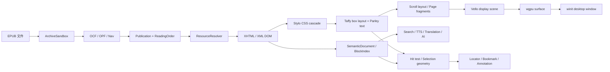

# rebook-desktop EPUB 技术方案

- 调研日期：2026-07-23
- 目标平台：Windows、macOS、Linux
- 第一格式：EPUB 3.3，兼容常见 EPUB 2
- 约束：无 WebView；正文解析、布局、分页和绘制在 Rust 内完成

## 结论

可行，但要把目标分成两层：

1. “能高质量阅读大多数小说类 EPUB”可以用 Rust 原生栈在数月内做到。
2. “完整 EPUB 3 Reading System”接近持续维护的小型浏览器工程。W3C 要求 CSS 达到官方 CSS 定义，视觉系统还涉及 OpenType/WOFF、SVG、固定版式、MathML、双向文字和全球排版，不能用一个富文本组件代替。

推荐采用“EPUB 专用引擎 + 复用浏览器级 Rust 组件”的路线：以 Blitz 当前采用的 `xml5ever + Stylo + Taffy + Parley + Vello` 为起点，在本项目内实现 EPUB 容器、资源沙箱、阅读器样式、分页/碎片化、Locator、选择/高亮和缓存。Blitz 仍是 pre-alpha，因此必须固定版本并放在后端适配层后面。

MVP 先支持无 DRM、无脚本、可重排 EPUB，默认连续滚动；分页紧随其后。这样能先验证最危险的文字、CSS、资源和命中测试链路，又不会让一个尚未实现的完整分页算法阻塞首个可用版本。

这里的“纯原生”定义为：不嵌入系统 WebView、不打包浏览器内核，应用层和文档渲染管线使用 Rust crate，并直接接入窗口、字体和 GPU API。它不表示二进制完全不调用操作系统动态库或图形驱动；`winit`、`wgpu`、系统字体发现、输入法和文件对话框仍然需要平台接口。依赖审计中应分别记录 Rust 实现比例、`unsafe` 和 FFI，而不是用一个含糊的“100% Rust”标签掩盖它们。

## 规范边界

[EPUB 3.3](https://www.w3.org/TR/epub-33/) 在 2026-01-13 成为 W3C Recommendation。一个 EPUB 至少涉及：

- ZIP/OCF 容器与 `META-INF/container.xml`；
- OPF package document 中的 metadata、manifest、spine；
- XHTML/SVG content document；
- EPUB Navigation Document，兼容 EPUB 2 时还要处理 NCX；
- CSS、图片、字体以及资源相对 URL；
- reflowable 与 pre-paginated 两种版式；
- 页面前进方向、spread、orientation 和 flow；
- 字体混淆、fallback、远程资源和可选脚本/媒体能力。

[EPUB Reading Systems 3.3](https://www.w3.org/TR/epub-rs-33/) 对视觉阅读器的要求比“解析成功”更高。它要求通过 CSS 显示 XHTML，支持 TrueType、OpenType、WOFF、WOFF2 的 `@font-face`，处理 SVG，并支持 fixed-layout；脚本和表单提交则不是强制能力。首版禁用脚本在规范上可成立，但必须正确执行无脚本 fallback 和安全策略。

因此项目对“完整”的定义应是：公开支持矩阵，并以 [W3C EPUB Tests](https://w3c.github.io/epub-tests/index.html) 的 MUST/SHOULD 用例通过率和项目回归库衡量。W3C 的 [EPUBCheck](https://github.com/w3c/epubcheck) 用于验证输入书是否合规，不能代替阅读器渲染测试。

## 技术路线比较

| 路线 | 原生/无 WebView | 兼容上限 | 工程风险 | 结论 |
| --- | --- | --- | --- | --- |
| 嵌入 Servo | 是 | 最高，接近浏览器 | 构建重、浏览器能力和安全面过大、分页定制困难 | 兼容性对照/兜底 |
| Blitz 组件栈 + EPUB 专用层 | 是，主体为 Rust | 中高，可持续补齐 | Blitz pre-alpha；分页、竖排缺失 | 推荐主线 |
| 从低层 crate 完全自研 | 是 | 理论可控 | CSS、Unicode、字体、表格、碎片化工作量极高 | 不建议作为起点 |
| WebView/Chromium | 否 | 高 | 与产品约束冲突 | 排除 |

Blitz 的价值不是一个可直接交付的浏览器，而是它已经把关键 Rust 组件接到一起：`blitz-dom` 使用 Stylo、Taffy、Parley，`blitz-html` 使用 html5ever/xml5ever，绘制后端可接 Vello。它的 README 同时明确标注 pre-alpha，且当前 [CSS 支持矩阵](https://blitz.is/status/css) 显示竖排、inline bidi、连字符、部分定位/表格等仍不完整，所以项目必须保有自己的后端边界和补丁策略。

## 推荐架构

本节给出渲染技术主线；现有 `rebook` / `rebook-web` 的逐层复盘、复用矩阵、会话状态机、三种内容表示、存储与迁移计划见 [rebook-reference-architecture.md](rebook-reference-architecture.md)。



建议的 Cargo workspace 边界：

```text
rebook-desktop/
  apps/
    desktop/          # winit/wgpu、窗口、菜单、快捷键、文件对话框、应用控件
  crates/
    epub/             # OCF、OPF、Nav/NCX、资源沙箱、字体混淆
    publication/      # 格式无关的 Publication、Link、Locator、ReadingOrder
    renderer/         # DOM/CSS、布局、分页、绘制、命中测试、选择
    reader/           # 导航、会话、主题、书签、批注、搜索、缓存策略
    storage/          # 书库、设置、进度、批注持久化
  test-data/          # 只放许可清晰或自行生成的 EPUB
  docs/
```

不要在最初就继续拆分 `style/layout/paint` crate。先把它们作为 `renderer` 内部模块，等接口稳定或编译时间确实需要时再拆。

### 从 rebook / rebook-web 继承的边界

保留以下经过现有项目验证的领域设计：

- `Book + Section` 演进为 `Publication + SpineItem`，章节与资源保持 pull-based 懒加载；
- `ReaderSession` 演进为串行命令驱动的 `ReaderController`，统一 open/close、导航、搜索、marks 和事件；
- `ContentEngineRouter` 继续隔离 reflowable、fixed-layout 和 fallback 引擎，并在重建时回放设置、Locator 与 marks；
- `PageSurface + TextProvider` 演进为原生 scene、hit-test index、visible range 和 accessibility subtree 的只读快照；
- `BlockWindowEvent` 泛化为视口窗口通知，为预取、TTS、翻译和全文索引提供背压；
- `BookLocation/Range/Selection` 演进为版本化 `LocatorV1/SourceRange/Selection`，搜索、批注和进度共享同一坐标系统。

同时明确三种内容表示：

1. `CanonicalDocument` 保存规范 DOM 与作者样式，是正文级联和排版的唯一真相源；
2. `SemanticDocument/BlockIndex` 从 DOM 派生，服务搜索、TTS、翻译、AI 和无障碍；
3. `FragmentTree/PageSurface` 是随 viewport、DPI、字体和用户样式变化的短生命周期几何结果。

不能把现有浏览器 renderer 的 `TextBlock -> 可见 DOM` 重建方式直接移植为原生 renderer。它适合语义服务和小窗口虚拟化，却不足以保存完整 CSS、ruby、bidi、table、float 和定位语义。三种表示必须通过稳定 `SourceAnchor` 对齐。

### 1. EPUB 与资源层

`crates/epub` 不需要承担 XHTML 排版，只负责把一个不可信归档转换为可靠的 Publication：

- 用成熟 ZIP crate 随机读取归档，不把整本书解压到磁盘；
- 用 namespace-aware XML reader 解析 container、OPF、encryption、NCX；
- 规范化内部路径、fragment 和 percent encoding，所有相对 URL 都相对当前资源解析；
- 保持 manifest/spine 顺序，记录 `linear`、properties、fallback 和 media type；
- 解析 EPUB 3 nav，兼容 EPUB 2 NCX；
- 实现 IDPF/Adobe 字体混淆；这不是商业 DRM；
- 暴露只读 `ResourceResolver`，让 CSS、图片、字体和 SVG 都走同一入口。

解析实现建议使用 [`zip`](https://docs.rs/zip/latest/zip/) + [`quick-xml`](https://docs.rs/quick-xml/latest/quick_xml/)；新近的 [`lib-epub`](https://docs.rs/lib-epub/latest/lib_epub/) 可用于行为对照和原型，但当前项目规模、生态验证和 API 变动历史不足以把安全边界完全托付给它。

核心接口保持 pull-based，避免 EPUB 层依赖 UI 或渲染器：

```rust
pub trait Publication {
    fn metadata(&self) -> &Metadata;
    fn reading_order(&self) -> &[Link];
    fn table_of_contents(&self) -> &[TocEntry];
    fn resource(&self, href: &PublicationUrl) -> Result<Resource>;
}
```

### 2. DOM 与 CSS

- XHTML 用 `xml5ever`，只有明确的 HTML 内容才用 [`html5ever`](https://github.com/servo/html5ever)；不能把所有 XHTML 都按宽松 HTML 语法处理。
- CSS 解析、selector matching、cascade、inheritance、custom properties 和 media queries 复用 [`Stylo`](https://github.com/servo/stylo)。
- 三层样式必须保持正式的 cascade：作者样式、阅读器 UA 样式、用户偏好样式。
- 用户改字体、字号、行高、边距、颜色或横竖排时，生成受控的 user origin 样式，不直接篡改 DOM，也不粗暴删除作者 CSS。
- 内容资源使用 `epub://<book-id>/<path>` 这样的逻辑 URL；它只是进程内标识，不注册网络协议，也不把本地路径暴露给正文。

Phase 1 必须覆盖的 CSS 子集：block/inline/inline-block、margin/padding/border/background、width/min/max、基本 absolute、float、table、list、图片尺寸、`@font-face`、常用 text/font 属性、`white-space`、`word-break`、`overflow-wrap`、`text-indent`、ruby 的基础布局。Grid、复杂 transform、filter、animation 可后置。

### 3. 文本与字体

首选 [`Parley`](https://github.com/linebender/parley)。它的栈包含：

- Fontique：系统字体枚举和 fallback；
- HarfRust：复杂文字 shaping；
- Skrifa：TrueType/OpenType 读取和 glyph outline；
- ICU4X：语言、bidi、分词、规范化等国际化分析；
- Parley：换行、glyph 定位、选择和编辑工具。

这比单独堆 `rustybuzz + unicode-bidi + unicode-linebreak` 更适合作为长期基础。`cosmic-text` 是成熟度不错的纯 Rust 备选，但 Blitz/Vello 与 Parley 的组合更一致。

字体策略：

- 优先书内 `@font-face`，然后用户指定字体，最后按脚本/语言做系统 fallback；
- 字体缓存以 font bytes hash + face index + variation coordinates 为键；
- 不允许字体资源无限制分配；损坏字体必须返回可诊断错误并 fallback；
- 明确测试中文简繁、日文、韩文、阿拉伯文、希伯来文、印地文、emoji、组合附加符；
- 竖排不应通过把横排画布旋转 90° 伪造，它需要竖向 glyph feature、标点挤压、tate-chu-yoko、ruby 和不同的行推进方向。

### 4. 布局、滚动与分页

盒布局以 [`Taffy`](https://github.com/DioxusLabs/taffy) 为基础。它已实现 CSS Block、Flexbox、Grid，但电子书还需要项目自己的 fragment/page 层。

按两个阶段做：

1. 连续滚动：每个 spine item 是独立布局文档，按视口附近章节预取；这是最短的端到端正确路径。
2. 动态分页：将 line box、block box、replaced element 变成可断开的 fragment，在固定 content area 中生成 page fragments；处理 widows/orphans、`break-*`、不可分割元素、超大图片、表格、脚注和跨页选择。

第一版分页可以先对连续布局结果按 line/block 边界切片，但接口必须表现为 `FragmentTree`，不能把“整章画好后按像素裁切”固化为架构。后者会在表格、浮动、背景边框、书签定位和选择上迅速失控。

任何影响排版的设置变化都会使页数变化，因此：

- 页面编号只作为当前布局会话的派生值；
- 缓存键至少包含 content hash、viewport、DPI、writing mode、字体集合和 reader style hash；
- 当前位置保存为 Locator，重新排版后再解析到新页；
- 当前页前后预布局，远端页按章节和页段淘汰，不能一次常驻整本 display list。

### 5. 绘制与桌面壳

绘制首选 [`Vello`](https://github.com/linebender/vello) + `wgpu`。Vello 能绘制路径、文字、图片、渐变和裁剪，但官方仍称 alpha，因此渲染层也要有窄接口：

```rust
pub trait RenderBackend {
    fn prepare(&mut self, fragments: &FragmentTree, scale: f32) -> Result<SceneId>;
    fn paint(&mut self, scene: SceneId, target: &RenderTarget) -> Result<()>;
    fn discard(&mut self, scene: SceneId);
}
```

静态 SVG 可用 [`resvg`](https://github.com/linebender/resvg) 解析/栅格化作为首版方案，后续再接入 Vello scene；必须区分外链 SVG 与内联 SVG 的 CSS 作用域。

桌面层使用 `winit + wgpu`。书架、目录、设置、搜索框和工具条可以用 `egui-winit + egui-wgpu` 快速实现，两套绘制共享同一设备/队列；正文区域始终由 renderer 输出，不使用 `egui` 的文本布局。无障碍树用 AccessKit，并由 DOM/fragment tree 生成语义节点，不从绘制命令反推。

### 6. Locator、选择、书签和批注

页码不稳定。采用 [Readium Locator](https://readium.org/architecture/models/locators/) 思路，至少保存：

- `href` 和 media type；
- resource progression 与 total progression；
- DOM range 或 partial CFI；
- 命中文本及 before/after 上下文；
- 当前布局的派生 position/page 仅作显示和加速。

渲染器必须从一开始提供双向映射：

```text
(DOM node, UTF-8/字符范围) <-> glyph run / fragment rect <-> viewport point
```

没有这层映射，后补文字选择、高亮、搜索跳转、TTS 跟随和无障碍会非常痛苦。范围偏移的内部单位应统一，并明确 UTF-8 bytes、Unicode scalar 和 grapheme cluster 的转换边界。

## 安全模型

EPUB 是不可信输入。即使没有 JavaScript，也要防归档、XML、图片、字体和 CSS 的资源耗尽。

- 不允许 ZIP entry 逃逸归档根；规范化后拒绝绝对路径、盘符、`..` 和重复解码绕过。
- 对归档 entry 数、单文件解压大小、总解压大小、压缩比、XML 深度、DOM 节点数、图片像素数、字体大小设可配置上限。
- 资源按需流式读取，不调用“extract all”。
- XML 禁止外部实体和网络解析。
- 默认禁止 `http/https/file` 资源；可选远程资源必须逐书授权、缓存隔离并有大小/类型限制。
- MVP 删除或忽略脚本、事件处理属性、表单提交、导航到进程外协议；外部链接交给用户确认后由系统浏览器打开。
- `data:` URL 设置大小上限；CSS `url()` 全部经 ResourceResolver。
- 解析、布局和图片解码任务支持取消、超时和内存预算；窗口主线程不执行长章节解析。
- 错误要分为 InvalidPublication、UnsupportedFeature、ResourceLimit、RenderFailure，并提供开发者诊断面板。

## MVP 支持矩阵

| 能力 | MVP | 后续高兼容阶段 |
| --- | --- | --- |
| OCF/OPF 2/3、manifest、spine、metadata | 是 | 更完整错误恢复、多 rendition |
| EPUB 3 nav / EPUB 2 NCX | 是 | page-list、landmarks 完整语义 |
| 可重排 XHTML + 常用 CSS | 是 | 浏览器级 CSS 覆盖 |
| 中文/西文/常见复杂文字 shaping | 是 | 更完整语言特例、连字符 |
| 图片、书内字体、字体混淆 | 是 | AVIF 等扩展资源 |
| 连续滚动 | 是 | 跨 spine 无缝虚拟化 |
| 动态分页 | Phase 2 | 完整 fragmentation、widow/orphan、脚注 |
| 目录、跳转、进度、主题、字号 | 是 | 多栏、spread、精细作者/用户样式策略 |
| 选择、复制、书签 | Phase 2 | 稳健 CFI/DOM Range 恢复 |
| 搜索、高亮、批注 | Phase 2 | 语言分词、批注导入导出 |
| 竖排、ruby、RTL | 基础 ruby/RTL | 完整 writing-mode 与东亚排版 |
| Fixed-layout | 否 | Phase 3 |
| SVG | 静态基础 | 内联 CSS、完整 SVG 语义 |
| MathML | fallback | Presentation MathML 原生布局 |
| Media Overlay / TTS | 否 | Phase 4 |
| JavaScript / 表单 / DRM | 否 | 默认仍不支持；按产品决策另立项目 |

## 实施阶段与验收

### Phase 0：纵向技术样板，1–2 周

实现状态：纵向链路已于 2026-07-23 落地，结论为有条件 Go；完成项、基准和未通过门槛见 [Phase 0 状态](phase-0-status.md)。

目标不是做 UI，而是验证最高风险链路。

- 建立 workspace 和 CI；固定 Blitz/Stylo/Parley/Vello commit。
- 内存读取一个 EPUB，解析 container、OPF、spine、nav。
- 通过自定义 ResourceResolver 原生渲染一个 XHTML spine item。
- 覆盖外链/内联 CSS、相对图片、书内字体、中文 fallback、滚动、链接和文字命中测试。
- 记录首次排版、窗口 resize 重排、稳定帧、峰值内存和 scene 大小。
- 同一组章节用 Servo 截图作为肉眼/像素差异参考，不把 Servo 带入产品。

Go/No-Go 门槛：

- 典型小说章（约 1–2 万汉字）首次可见内容目标小于 300 ms，后台完成整章目标小于 1 s；
- 10 万汉字压力章可取消、界面不冻结、峰值内存有明确上限；
- resize 过程中允许降级，但结束后 200 ms 内开始提交新布局；
- 中文/阿拉伯文/emoji 测试无漏字和明显顺序错误；
- point → text range → rect 往返稳定，可支撑选择；
- 相对资源和字体都只能经受限 resolver 加载。

这些数值是首轮工程目标，不是未经测试的产品承诺；样板结束后按实测调整。

### Phase 1：可用的滚动阅读器，4–6 周

- 完成安全 EPUB 层、错误模型、目录和资源缓存；
- 多 spine 导航、连续/分章滚动、恢复阅读位置；
- 主题、字号、行高、页边距、字体、快捷键；
- 基础书架、封面、元数据和最近阅读；
- W3C 测试按能力标签接入，建立 20–50 本许可清晰的回归书库；
- Linux/Windows/macOS 至少有编译和启动冒烟测试。

### Phase 2：分页与阅读交互，6–10 周

- page fragment、单双页、页面方向和重排缓存；
- 选择、复制、书签、高亮、批注；
- 全文索引和搜索结果 Locator；
- 跨重排恢复、窗口缩放、DPI/显示器切换；
- 大书虚拟化、预取、取消和内存预算。

### Phase 3：复杂排版，8–12 周

- `writing-mode`、竖排标点、纵中横、完整 ruby、bidi；
- fixed-layout、synthetic spread、orientation；
- 更完整 table/float/position/transform；
- 内联/外链 SVG 的正确 CSS 行为；
- EPUB 3.3 必须项覆盖率报告。

### Phase 4：规范长尾，持续进行

- Presentation MathML 原生布局；
- Media Overlay、TTS 语义、无障碍增强；
- page-list、landmarks、fallback chains、更多媒体；
- EPUB 3.4 演进跟踪、模糊测试、上游补丁和安全维护。

单人开发的现实预期：2–3 个月可得到“普通小说好用”的 alpha，6–12 个月才能接近高覆盖阅读器；浏览器级完整 CSS/全球排版和 EPUB 全规范是持续、多年的维护目标。团队规模、现有 Rust/排版经验和是否向上游贡献会显著改变时间。

## 测试策略

### 分层测试

- Parser golden tests：container/OPF/nav/NCX/encryption/path resolution。
- Security tests：zip slip、zip bomb、深层 XML、超大 data URL、损坏字体/图片、循环 fallback。
- Layout unit tests：line/block fragment、break、widow/orphan、RTL、ruby、竖排。
- Screenshot tests：固定字体、固定 DPI、软件渲染/可控 GPU 后端，记录允许的像素阈值。
- Interaction tests：point/range/rect 往返、选择跨行/跨页、链接命中。
- Reflow invariants：设置变化后 Locator 仍落到相同文本上下文。
- Performance benchmarks：首屏、整章、resize、翻页、缓存命中、峰值内存。

### 测试来源

- [W3C EPUB Tests](https://github.com/w3c/epub-tests)：规范 MUST/SHOULD/MAY 覆盖；
- [Web Platform Tests](https://github.com/web-platform-tests/wpt)：选择性引入 CSS/HTML/XML 子集；
- Blitz/Stylo/Taffy/Parley/resvg 上游测试：随固定 commit 一起跑关键子集；
- 自生成最小 EPUB：每个 bug 一个最小文件；
- 真实回归书库：只纳入许可证明确、可在 CI 使用的样本。

每项能力在矩阵中必须有四种状态：Unsupported、Partial、Supported、Disabled by policy。这样能区分“没做”“只覆盖一部分”“规范已覆盖”和“出于安全/产品选择禁用”。

## 主要风险与缓解

| 风险 | 影响 | 缓解 |
| --- | --- | --- |
| Blitz/Vello API 和行为快速变化 | 升级破坏、渲染回归 | 固定 commit、内部适配层、定期升级窗口、保留小 fork |
| 分页不是 Taffy 的现成功能 | 页断、表格、浮动错误 | 先滚动，独立 FragmentTree，从 line/block 边界逐步实现 |
| 竖排目前是上游明显缺口 | 中文/日文书兼容性不足 | 早建 writing-mode 抽象，Phase 0 不伪装支持，Phase 3 专项投入 |
| 字体/Unicode 长尾巨大 | 漏字、错序、平台差异 | Parley/ICU4X、固定测试字体、跨平台脚本矩阵 |
| 不可信 EPUB 资源耗尽 | 崩溃、卡死、磁盘/内存攻击 | 资源沙箱、预算、取消、模糊测试、默认无网络无脚本 |
| “完整”目标失控 | 一直无法发布 | 按支持矩阵分层发布，以 W3C 测试覆盖率而不是口号验收 |
| 第三方许可/上游分叉 | 发布或维护成本 | 依赖审计、NOTICE/SBOM、优先 Apache-2.0/MIT/MPL 兼容组件、补丁回馈上游 |

## Phase 0 已冻结与待决策项

Phase 0 已冻结工具链和渲染适配边界；产品/平台项留到对应里程碑决定：

1. MSRV 为 1.97，`rust-toolchain.toml` 固定 1.97.1；
2. Blitz 固定 `0.3.0-beta.1`，其 Stylo/Parley/Vello 依赖由 `Cargo.lock` 固定，升级必须经过回归窗口；
3. `egui` 是否只用于开发壳，还是作为首版正式 chrome；
4. 持久化用纯 Rust KV/数据库还是系统 SQLite；
5. 三个平台的最低系统版本与 GPU fallback；
6. 测试 EPUB 的许可清单和 CI 制品策略。

当前工作环境已通过 `rustup` 安装 stable `1.97.1`（`aarch64-unknown-linux-gnu`），配置 RsProxy Cargo Sparse 镜像，并由项目级 `rust-toolchain.toml` 固定工具链、rustfmt 和 clippy。

## 参考资料

- [W3C EPUB 3.3](https://www.w3.org/TR/epub-33/)
- [W3C EPUB Reading Systems 3.3](https://www.w3.org/TR/epub-rs-33/)
- [W3C EPUB Tests](https://w3c.github.io/epub-tests/index.html)
- [EPUBCheck](https://github.com/w3c/epubcheck)
- [Blitz 架构与状态](https://github.com/DioxusLabs/blitz)
- [Blitz CSS 支持矩阵](https://blitz.is/status/css)
- [Stylo](https://github.com/servo/stylo)
- [Taffy](https://github.com/DioxusLabs/taffy)
- [Parley](https://github.com/linebender/parley)
- [Vello](https://github.com/linebender/vello)
- [resvg](https://github.com/linebender/resvg)
- [Servo 嵌入文档](https://book.servo.org/embedding/overview.html)
- [Readium Locator](https://readium.org/architecture/models/locators/)
